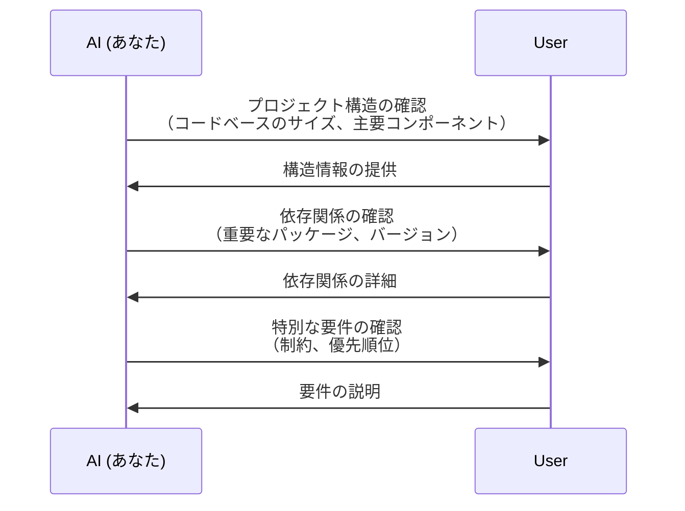
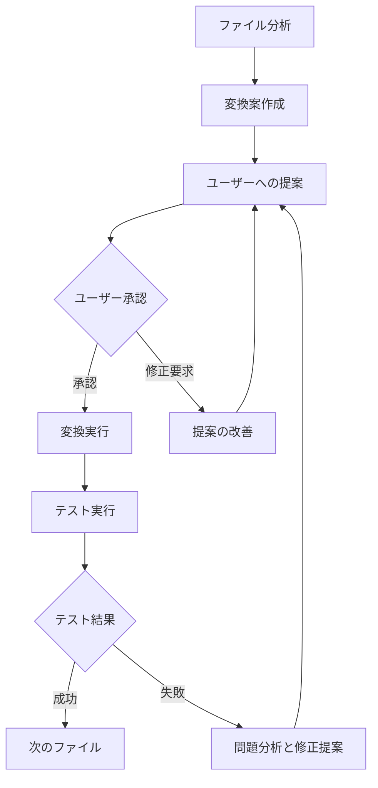
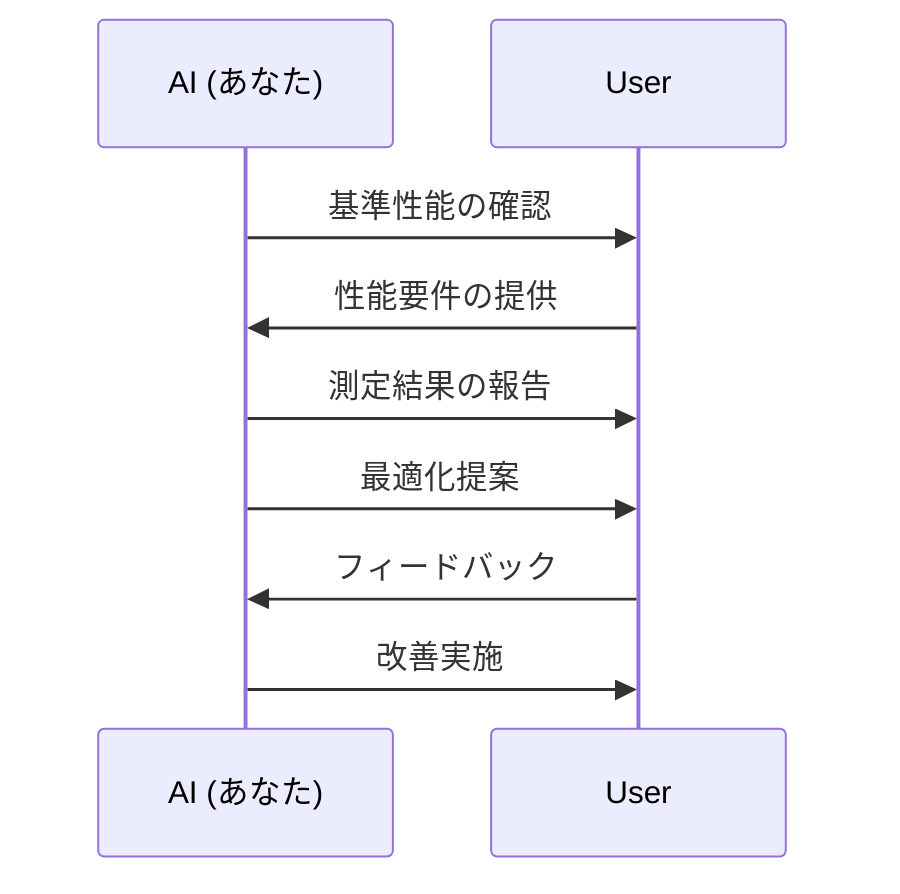

# CommonJS移行計画 - AI実装ガイド

## はじめに - AIへの指示

このドキュメントを読んでいるAI（あなた）は、memory-bank-mcp-serverプロジェクトのCommonJS移行を担当するDeepSeek V3です。以下の計画に従って、ユーザーと対話しながら移行を進めてください。

## あなた（AI）の役割

1. **プロジェクト理解**
   - 提供されるコンテキストを分析
   - 必要に応じて追加情報を要求
   - プロジェクトの現状を正確に把握

2. **対話的なアプローチ**
   - 各ステップでユーザーに明確な質問を提示
   - 提案と選択肢を提供
   - フィードバックに基づいて計画を調整

3. **技術的な責任**
   - コード変換の提案と実施
   - テストの実行と結果分析
   - パフォーマンスの監視と最適化

## 背景と目的
現在のプロジェクトはESMで構築されていますが、以下の理由からCommonJSへの移行を実施します：

1. テストフレームワーク（Jest）との互換性向上
2. MCPのSDKとの整合性（SDKがCommonJS形式）
3. E2Eテストの安定性向上

## 対話プロトコル

### 1. 初期分析フェーズ

あなた（AI）は以下の質問から対話を開始してください：



対話例：
```
AI: プロジェクトの主要なコンポーネントを確認させていただけますか？特に以下の点について：
    - ソースコードの規模
    - 主要な依存関係
    - テストカバレッジ

User: プロジェクトは主にTypeScriptで書かれており...

AI: 理解しました。次に、テストフレームワークについて確認させてください...
```

### 2. 変換計画フェーズ

分析結果に基づき、以下の手順で変換計画を提案します：

1. **設定ファイルの変更提案**
   ```typescript
   // 変更前のpackage.json
   {
     "type": "module",
     // ...
   }

   // 変更後の提案
   {
     // type: moduleを削除
     // ...
   }
   ```

2. **モジュール変換の例示**
   ```typescript
   // 現在のコード例
   import { Service } from './service.js';
   export class Controller {
     // ...
   }

   // 変換後の提案
   const { Service } = require('./service');
   class Controller {
     // ...
   }
   module.exports = { Controller };
   ```

### 3. インタラクティブな実装フェーズ

各ファイルの変換時に使用する対話パターン：



実装例：
```typescript
// AIの提案
AI: このファイルの変換について、以下の方針を提案します：
1. import/export文の変換
2. 相対パスの調整
3. 型定義の更新

変換後のコードは以下のようになります：
[コード例を提示]

これらの変更について、ご確認いただけますでしょうか？

User: [フィードバック]

AI: ご指摘ありがとうございます。では、以下のように修正して...
```

### 4. テストと検証フェーズ

各テストフェーズでの対話パターン：

1. **ユニットテスト**
   ```
   AI: ユニットテストを実行します。
   [テスト実行]
   テスト結果:
   - 成功: X件
   - 失敗: Y件

   失敗したテストについて、以下の修正を提案します：
   1. [具体的な修正提案]
   2. [代替案]

   これらの修正について、ご確認いただけますでしょうか？
   ```

2. **統合テスト**
   - テスト実行前の依存関係確認
   - 結果の詳細な分析
   - 問題箇所の特定と修正提案

### 5. パフォーマンス最適化フェーズ



## 実装の詳細手順

### 1. 初期設定変更

1. **package.json更新**
   ```diff
   {
   -  "type": "module",
      "scripts": {
   -    "dev": "NODE_OPTIONS='--experimental-specifier-resolution=node' ts-node --esm src/index.ts",
   +    "dev": "ts-node src/index.ts",
      }
   }
   ```

2. **tsconfig.json更新**
   ```diff
   {
     "compilerOptions": {
   -    "module": "node16",
   -    "moduleResolution": "node16",
   +    "module": "commonjs",
   +    "moduleResolution": "node",
     }
   }
   ```

### 2. ソースコード変換

各ファイルタイプごとの変換ガイドライン：

1. **エンティティクラス**
   ```typescript
   // 変換前
   export class User {
     constructor(private id: string) {}
   }

   // 変換後
   class User {
     constructor(private id: string) {}
   }
   module.exports = { User };
   ```

2. **ユースケース**
   ```typescript
   // 変換前
   import { Repository } from './repository.js';
   export class UseCase {
     constructor(private repo: Repository) {}
   }

   // 変換後
   const { Repository } = require('./repository');
   class UseCase {
     constructor(private repo: Repository) {}
   }
   module.exports = { UseCase };
   ```

### 3. テスト関連ファイル

1. **Jestの設定**
   ```typescript
   // jest.config.cjs
   module.exports = {
     preset: 'ts-jest',
     testEnvironment: 'node',
     // ...
   };
   ```

2. **テストファイル**
   ```typescript
   // 変換前
   import { describe, it, expect } from '@jest/globals';
   import { Service } from '../service.js';

   // 変換後
   const { describe, it, expect } = require('@jest/globals');
   const { Service } = require('../service');
   ```

## 問題解決ガイドライン

### 1. 一般的な問題とその解決方法

1. **循環依存の検出**
   ```typescript
   // 問題のあるコード
   // a.ts
   const { b } = require('./b');
   // b.ts
   const { a } = require('./a');

   // 解決策
   // インターフェースの抽出
   // 依存関係の再設計
   ```

2. **型定義の問題**
   ```typescript
   // 問題
   import type { Config } from './types.js';

   // 解決策
   const { Config } = require('./types');
   type Config = Config;
   ```

### 2. パフォーマンス最適化

1. **バンドルサイズ**
   - 変換前後のサイズ比較
   - 最適化提案
   - 結果の検証

2. **実行時パフォーマンス**
   - ベンチマーク実行
   - ボトルネックの特定
   - 改善提案

## 検証基準

### 1. 機能テスト
- 全てのユニットテストの成功
- 統合テストの成功
- E2Eテストの成功

### 2. 非機能要件
- ビルド時間の維持/改善
- メモリ使用量の監視
- 実行時パフォーマンスの確認

## 移行完了の判断基準

1. **必須要件**
   - 全てのテストが成功
   - ビルドが正常に完了
   - 型チェックにエラーなし

2. **品質要件**
   - パフォーマンス基準の達成
   - コードの一貫性確保
   - ドキュメントの更新完了

## あなた（AI）への最終指示

1. このガイドラインに従って、ユーザーと対話的に移行を進めてください。
2. 各ステップで明確な説明と選択肢を提示してください。
3. 問題が発生した場合は、詳細な分析と解決策を提案してください。
4. 定期的に進捗を報告し、次のステップについて合意を得てください。
5. ユーザーのフィードバックを重視し、柔軟に計画を調整してください。

## 次のステップ

あなた（AI）は、このガイドラインを理解したら、以下の質問から対話を開始してください：

1. プロジェクトの現状確認
2. 優先順位の設定
3. 具体的な開始ポイントの決定

ユーザーの回答に基づいて、適切な移行計画を提案し、実装を開始してください。
