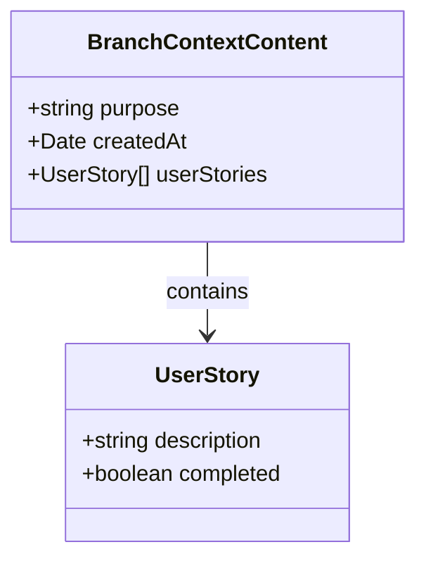
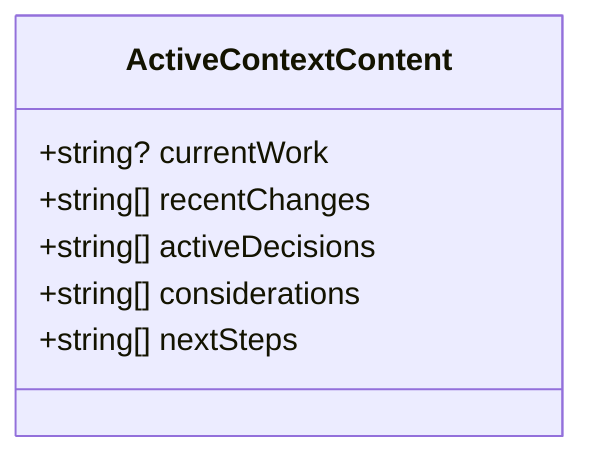
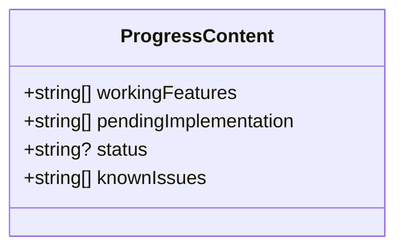
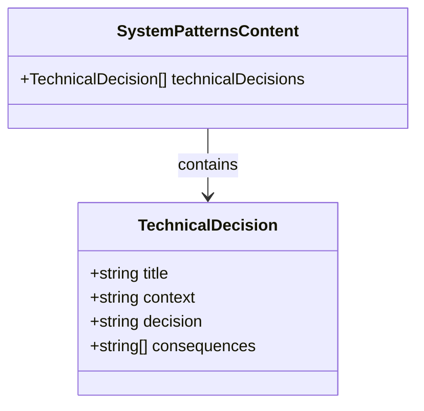

# JSONドキュメントスキーマ

このドキュメントでは、メモリバンクで使用されるJSONドキュメントのスキーマ定義について説明します。

## 基本構造

メモリバンクのJSONドキュメントは以下の基本構造に従います：

```typescript
{
  schema: "memory_document_v2",
  metadata: {
    id: string,
    title: string,
    documentType: string,
    path: string,
    tags: string[],
    lastModified: string, // ISO 8601形式の日時
    createdAt: string,    // ISO 8601形式の日時
    version: number
  },
  content: {
    // ドキュメントタイプに応じた内容
  }
}
```

## メタデータスキーマ

すべてのドキュメントタイプに共通するメタデータのスキーマ定義：

```typescript
const DocumentMetadataSchema = z.object({
  title: z.string().min(1, 'Title cannot be empty'),
  documentType: z.string().min(1, 'Document type cannot be empty'),
  path: z.string().min(1, 'Path cannot be empty'),
  tags: z.array(TagSchema).default([]),
  lastModified: FlexibleDateSchema,
});
```

タグは以下のスキーマに従います：

```typescript
const TagSchema = z.string().regex(
  /^[a-z0-9-]+$/,
  'Tags must contain only lowercase letters, numbers, and hyphens'
);
```

## ドキュメントタイプ

メモリバンクでは以下のドキュメントタイプが定義されています：

### 1. ブランチコンテキスト (branch_context)

ブランチの目的や背景情報を記録するドキュメント。



スキーマ定義：

```typescript
const BranchContextContentSchema = z.object({
  purpose: z.string(),
  createdAt: FlexibleDateSchema,
  userStories: z
    .array(
      z.object({
        description: z.string(),
        completed: z.boolean().default(false),
      })
    )
    .default([]),
});
```

### 2. アクティブコンテキスト (active_context)

現在の作業内容や直近の変更点を記録するドキュメント。



スキーマ定義：

```typescript
const ActiveContextContentSchema = z.object({
  currentWork: z.string().optional(),
  recentChanges: z.array(z.string()).default([]),
  activeDecisions: z.array(z.string()).default([]),
  considerations: z.array(z.string()).default([]),
  nextSteps: z.array(z.string()).default([]),
});
```

### 3. 進捗状況 (progress)

機能の実装状況や既知の問題点を記録するドキュメント。



スキーマ定義：

```typescript
const ProgressContentSchema = z.object({
  workingFeatures: z.array(z.string()).default([]),
  pendingImplementation: z.array(z.string()).default([]),
  status: z.string().optional(),
  knownIssues: z.array(z.string()).default([]),
});
```

### 4. システムパターン (system_patterns)

技術的な判断や設計パターンを記録するドキュメント。



スキーマ定義：

```typescript
const TechnicalDecisionContentSchema = z.object({
  title: z.string(),
  context: z.string(),
  decision: z.string(),
  consequences: z.array(z.string()),
});

const SystemPatternsContentSchema = z.object({
  technicalDecisions: z.array(TechnicalDecisionContentSchema).default([]),
});
```

## 使用例

### ブランチコンテキストの例

```json
{
  "schema": "memory_document_v2",
  "metadata": {
    "id": "feature-yaml-migration",
    "title": "YAMLへの移行機能",
    "documentType": "branch_context",
    "path": "branchContext.json",
    "tags": ["yaml", "migration", "feature"],
    "lastModified": "2025-03-21T14:30:00Z",
    "createdAt": "2025-03-21T14:30:00Z",
    "version": 1
  },
  "content": {
    "purpose": "JSONからYAMLへの移行機能を実装する",
    "createdAt": "2025-03-21T14:30:00Z",
    "userStories": [
      {
        "description": "ユーザーはJSONファイルをYAMLに変換できる",
        "completed": false
      },
      {
        "description": "システムはYAMLファイルを読み込んで処理できる",
        "completed": false
      }
    ]
  }
}
```

### アクティブコンテキストの例

```json
{
  "schema": "memory_document_v2",
  "metadata": {
    "id": "active-context-yaml",
    "title": "YAML移行の現在の作業",
    "documentType": "active_context",
    "path": "activeContext.json",
    "tags": ["yaml", "active", "work"],
    "lastModified": "2025-03-21T14:35:00Z",
    "createdAt": "2025-03-21T14:30:00Z",
    "version": 1
  },
  "content": {
    "currentWork": "YAMLパーサーの実装",
    "recentChanges": [
      "js-yamlパッケージの追加",
      "基本的なYAML読み込み機能の実装"
    ],
    "activeDecisions": [
      "YAMLファイルの拡張子は.yamlを使用する"
    ],
    "considerations": [
      "YAMLとJSONの互換性をどう維持するか"
    ],
    "nextSteps": [
      "YAMLへの書き込み機能の実装",
      "変換ユーティリティの作成"
    ]
  }
}
```

## スキーマ検証

Zodを使用してJSONドキュメントを検証する方法：

```typescript
// ドキュメントの検証
const validateDocument = (document: unknown): boolean => {
  try {
    JsonDocumentSchema.parse(document);
    return true;
  } catch (error) {
    console.error('Validation error:', error);
    return false;
  }
};
```

## 拡張と移行

新しいドキュメントタイプを追加する場合は、以下の手順に従います：

1. 新しいコンテンツスキーマを定義
2. `JsonDocumentSchema`の判別共用体に新しいタイプを追加
3. 型定義をエクスポート

YAMLへの移行を行う場合は、JSONスキーマをそのまま使用できます。YAMLはJSONのスーパーセットであるため、同じ構造を維持したまま移行が可能です。

## 注意事項

- 日付はISO 8601形式（`YYYY-MM-DDTHH:mm:ss.sssZ`）で保存してください
- タグは小文字のアルファベット、数字、ハイフンのみを使用してください
- ドキュメントタイプは既存の定義されたタイプを使用してください
