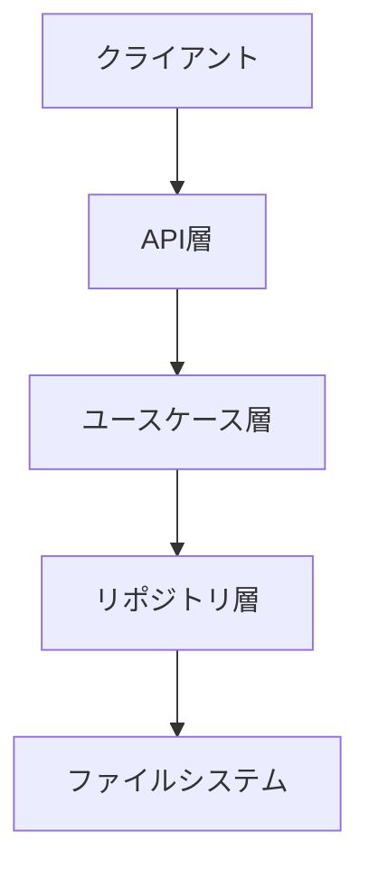

# Markdownとフロントマターを活用したハイブリッドアプローチ

## 概要

YAMLへの完全な移行やJSONエディタの実装に加えて、Markdownの利点を活かしながら構造化されたメタデータを管理する「ハイブリッドアプローチ」も有効な選択肢です。この文書では、Markdownのフロントマター（YAML形式のメタデータブロック）を活用したアプローチについて検討します。

## Markdownの利点

Markdownは以下の点で優れています：

1. **人間にとっての読みやすさと書きやすさ**:
   - シンプルな構文
   - テキストエディタで直接編集可能
   - 学習曲線が緩やか

2. **リッチコンテンツのサポート**:
   - コードブロック（シンタックスハイライト付き）
   - 表
   - リンクと画像
   - リスト（順序付き/順序なし）

3. **図表のサポート**:
   - Mermaid図表の直接埋め込み
   - PlantUML、Draw.io等の図表の埋め込み
   - 数式（MathJax/KaTeX）

4. **広範なツールサポート**:
   - VSCode、JetBrains IDEs等のエディタサポート
   - プレビュー機能
   - Git等のバージョン管理システムとの親和性

## フロントマターとは

フロントマターは、Markdownファイルの先頭に配置されるYAML形式のメタデータブロックです。多くの静的サイトジェネレーター（Jekyll、Hugo、Gatsby等）で使用されています。

**例**:
```markdown
---
title: システムアーキテクチャ
id: architecture
documentType: generic
tags:
  - architecture
  - system-design
lastModified: 2025-03-21T14:30:00Z
createdAt: 2025-03-21T14:30:00Z
version: 1
---

# システムアーキテクチャ

## 概要

システムアーキテクチャの説明

## コンポーネント

主要なシステムコンポーネントの一覧と説明

## 設計上の決定事項

重要なアーキテクチャ上の決定事項
```

フロントマターは `---` で囲まれ、その中にYAML形式でメタデータを記述します。本文はフロントマターの後に続きます。

## ハイブリッドアプローチの実装

### 1. メタデータとコンテンツの分離

このアプローチでは、ドキュメントを以下の2つの部分に論理的に分離します：

1. **構造化メタデータ** (フロントマター):
   - ID、タイトル、タグ、作成日、更新日などの構造化された情報
   - システムによる自動処理に使用

2. **人間向けコンテンツ** (Markdownの本文):
   - 人間が読み書きするテキスト、図表、コードなど
   - リッチな表現が可能

### 2. メタデータのみを読むモード

システムがドキュメントを処理する際に、フロントマターのみを読み取るモードを実装します：

```typescript
// フロントマターのみを読み取る関数の例
async function readFrontmatterOnly(filePath: string): Promise<DocumentMetadata> {
  const content = await fs.readFile(filePath, 'utf-8');
  const { data } = matter(content);  // gray-matter ライブラリを使用

  return {
    id: data.id,
    title: data.title,
    documentType: data.documentType,
    tags: data.tags || [],
    lastModified: new Date(data.lastModified),
    createdAt: new Date(data.createdAt),
    version: data.version
  };
}
```

このモードは以下の場面で有用です：

- ドキュメントのインデックス作成
- タグベースの検索
- メタデータの一覧表示
- 変更の検出

### 3. コンテンツ処理の拡張

Markdownの本文を処理する際に、以下の拡張機能を実装します：

1. **Mermaid図表のレンダリング**:
   ```typescript
   function renderMermaidDiagrams(markdown: string): string {
     // Mermaidコードブロックを検出し、SVGまたは画像に変換
     return markdown.replace(
       /```mermaid\n([\s\S]*?)\n```/g,
       (match, code) => {
         const svg = mermaid.render(code);
         return svg;
       }
     );
   }
   ```

2. **コードブロックのシンタックスハイライト**:
   ```typescript
   function highlightCodeBlocks(markdown: string): string {
     // コードブロックを検出し、シンタックスハイライトを適用
     return markdown.replace(
       /```(\w+)\n([\s\S]*?)\n```/g,
       (match, language, code) => {
         return highlight(code, { language });
       }
     );
   }
   ```

3. **数式のレンダリング**:
   ```typescript
   function renderMathEquations(markdown: string): string {
     // 数式を検出し、レンダリング
     return markdown
       .replace(/\$\$([\s\S]*?)\$\$/g, (match, equation) => {
         return katex.renderToString(equation, { displayMode: true });
       })
       .replace(/\$([\s\S]*?)\$/g, (match, equation) => {
         return katex.renderToString(equation, { displayMode: false });
       });
   }
   ```

### 4. 編集インターフェースの実装

ユーザーフレンドリーな編集インターフェースを提供します：

1. **分割ビュー**:
   - 左側にMarkdownエディタ
   - 右側にリアルタイムプレビュー

2. **メタデータフォーム**:
   - フロントマターを直接編集するのではなく、フォームUIを提供
   - 変更はフロントマターに自動反映

3. **図表エディタ**:
   - Mermaid図表の視覚的エディタ
   - コードと図表のリアルタイム同期

## 技術的な実装

### 1. パーサーとジェネレーター

```typescript
import matter from 'gray-matter';
import { stringify } from 'yaml';

// Markdownからメタデータと本文を抽出
function parseMarkdownWithFrontmatter(content: string) {
  const { data, content: markdownContent } = matter(content);
  return {
    metadata: data,
    content: markdownContent
  };
}

// メタデータと本文からMarkdownを生成
function generateMarkdownWithFrontmatter(metadata: Record<string, any>, content: string) {
  const frontmatter = stringify(metadata);
  return `---\n${frontmatter}---\n\n${content}`;
}
```

### 2. リポジトリの拡張

```typescript
// MarkdownWithFrontmatterリポジトリの例
export class MarkdownWithFrontmatterRepository implements IDocumentRepository {
  constructor(
    private readonly basePath: string,
    private readonly fileSystemService: IFileSystemService
  ) {}

  async findByPath(path: DocumentPath): Promise<MemoryDocument | null> {
    const filePath = this.resolvePath(path.value);

    if (!await this.fileSystemService.fileExists(filePath)) {
      return null;
    }

    const content = await this.fileSystemService.readFile(filePath);
    const { metadata, content: markdownContent } = parseMarkdownWithFrontmatter(content);

    // メタデータからMemoryDocumentを構築
    return MemoryDocument.create({
      path,
      content: markdownContent,
      tags: (metadata.tags || []).map(tag => Tag.create(tag)),
      lastModified: new Date(metadata.lastModified || Date.now()),
      metadata // 追加のメタデータを保持
    });
  }

  async save(document: MemoryDocument): Promise<void> {
    const filePath = this.resolvePath(document.path.value);

    // メタデータを構築
    const metadata = {
      id: document.id,
      title: document.title,
      documentType: document.documentType,
      path: document.path.value,
      tags: document.tags.map(tag => tag.value),
      lastModified: document.lastModified.toISOString(),
      createdAt: document.createdAt.toISOString(),
      version: document.version
    };

    // フロントマター付きMarkdownを生成
    const content = generateMarkdownWithFrontmatter(metadata, document.content);

    // ファイルに保存
    await this.fileSystemService.writeFile(filePath, content);
  }

  // その他のメソッド...
}
```

### 3. CLIコマンドの追加

```typescript
// Markdownメタデータ表示コマンドの例
export class ShowMarkdownMetadataCommand extends CommandBase {
  readonly command = 'show-metadata <path>';
  readonly description = 'Show metadata from Markdown file with frontmatter';

  builder(yargs: Argv): Argv {
    return yargs
      .positional('path', {
        describe: 'Path to Markdown file',
        type: 'string',
        demandOption: true
      });
  }

  async handler(argv: any): Promise<void> {
    try {
      const filePath = argv.path as string;
      const content = await fs.readFile(filePath, 'utf-8');
      const { data } = matter(content);

      console.log(JSON.stringify(data, null, 2));
    } catch (error) {
      this.handleError(error, 'Failed to show metadata');
    }
  }
}
```

## メリットとデメリット

### メリット

1. **人間とシステムの両方に最適化**:
   - 人間: Markdownの読みやすさと書きやすさ
   - システム: 構造化されたメタデータ

2. **リッチコンテンツのサポート**:
   - Mermaid図表
   - コードブロック
   - 数式
   - 表

3. **既存のツールとの互換性**:
   - VSCode等のエディタサポート
   - Git等のバージョン管理システム
   - Markdownプレビューツール

4. **段階的な移行が容易**:
   - 既存のMarkdownファイルにフロントマターを追加するだけで対応可能
   - 既存のJSONファイルからの変換も比較的容易

### デメリット

1. **メタデータと本文の同期**:
   - メタデータが本文と同期しない可能性（例: タイトルが異なる）
   - 検証と整合性チェックが必要

2. **パース処理の複雑さ**:
   - フロントマターと本文の両方を適切に処理する必要がある
   - エラーハンドリングが複雑になる可能性

3. **スキーマ検証の制限**:
   - フロントマターのスキーマ検証は可能だが、本文の構造的検証は難しい
   - 自由形式のコンテンツによる一貫性の欠如

4. **パフォーマンスへの影響**:
   - 大量のファイルを処理する場合、パース処理のオーバーヘッドが発生する可能性

## 実装計画

### フェーズ1: 基本実装（2週間）

1. **パーサーとジェネレーターの実装**:
   - フロントマター処理ライブラリの導入（gray-matter等）
   - メタデータの抽出と検証機能の実装

2. **リポジトリの拡張**:
   - `MarkdownWithFrontmatterRepository`の実装
   - 既存のリポジトリとの統合

3. **基本的なCLIコマンドの追加**:
   - メタデータ表示コマンド
   - フロントマター追加/更新コマンド

### フェーズ2: 拡張機能の実装（2週間）

1. **リッチコンテンツ処理の実装**:
   - Mermaid図表のレンダリング
   - コードブロックのシンタックスハイライト
   - 数式のレンダリング

2. **編集インターフェースの実装**:
   - 分割ビューエディタ
   - メタデータフォーム
   - リアルタイムプレビュー

3. **検索と索引機能の拡張**:
   - メタデータに基づく検索
   - 本文の全文検索
   - タグベースのナビゲーション

### フェーズ3: 移行ツールと統合（1週間）

1. **移行ツールの開発**:
   - JSONからMarkdown+フロントマターへの変換
   - 既存のMarkdownへのフロントマター追加

2. **既存システムとの統合**:
   - MCPサーバーとの統合
   - APIの拡張

3. **ドキュメントとガイドラインの作成**:
   - 使用方法のドキュメント
   - ベストプラクティスガイド

## 使用例

### 例1: アーキテクチャドキュメント

```markdown
---
id: architecture
title: システムアーキテクチャ
documentType: generic
tags:
  - architecture
  - system-design
lastModified: 2025-03-21T14:30:00Z
createdAt: 2025-03-21T14:30:00Z
version: 1
---

# システムアーキテクチャ

## 概要

このドキュメントでは、メモリバンクシステムのアーキテクチャについて説明します。

## システム構成

システムは以下のコンポーネントで構成されています：



## コンポーネント詳細

各コンポーネントの詳細は以下の通りです：

| コンポーネント | 責務 | 実装 |
|--------------|------|------|
| API層 | 外部リクエストの処理 | Express.js |
| ユースケース層 | ビジネスロジック | TypeScript |
| リポジトリ層 | データアクセス | カスタム実装 |
| ファイルシステム | データ永続化 | Node.js fs |

## 設計上の決定事項

1. クリーンアーキテクチャの採用
2. 依存性の注入によるテスト容易性の確保
3. ドメイン駆動設計の原則に従った実装
```

### 例2: コマンドラインでのメタデータ操作

```bash
# メタデータの表示
$ memory-bank show-metadata docs/architecture.md
{
  "id": "architecture",
  "title": "システムアーキテクチャ",
  "documentType": "generic",
  "tags": ["architecture", "system-design"],
  "lastModified": "2025-03-21T14:30:00Z",
  "createdAt": "2025-03-21T14:30:00Z",
  "version": 1
}

# メタデータの更新
$ memory-bank update-metadata docs/architecture.md --tags "architecture,design,documentation"
Metadata updated successfully

# タグによる検索
$ memory-bank search --tags "architecture"
docs/architecture.md
docs/component-design.md
docs/infrastructure.md
```

## 結論

Markdownとフロントマターを組み合わせたハイブリッドアプローチは、構造化されたメタデータと人間が読みやすいコンテンツの両方を提供する優れた選択肢です。このアプローチにより、Mermaid図表やコードブロックなどのリッチコンテンツを活用しながら、システムによる効率的なメタデータ処理も可能になります。

既存のMarkdownファイルからの移行も比較的容易であり、段階的な導入が可能です。また、VSCodeなどの既存のツールとの互換性も高く、開発者の生産性を維持することができます。

メタデータのみを読むモードをサポートすることで、パフォーマンスを最適化しながら、必要に応じて完全なコンテンツにアクセスすることも可能です。

このアプローチは、YAMLへの完全な移行やJSONエディタの実装と比較して、より迅速に導入でき、ユーザーの学習曲線も緩やかです。メモリバンクプロジェクトの要件に応じて、このハイブリッドアプローチを検討する価値があります。
