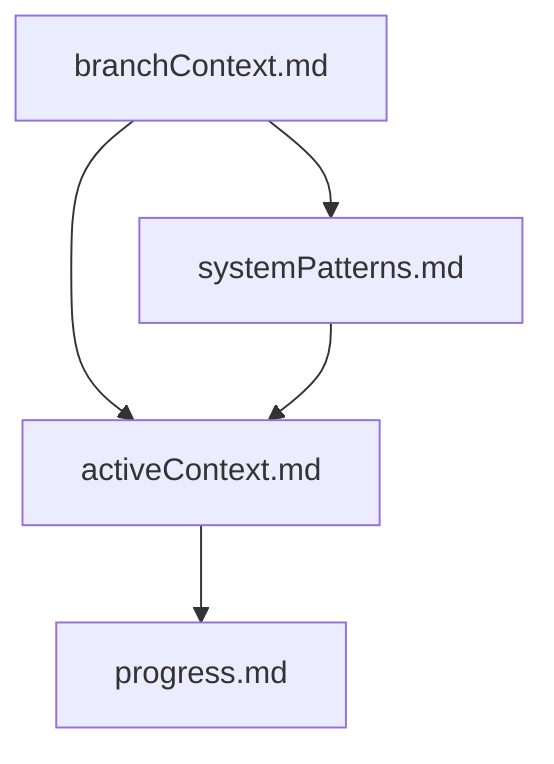
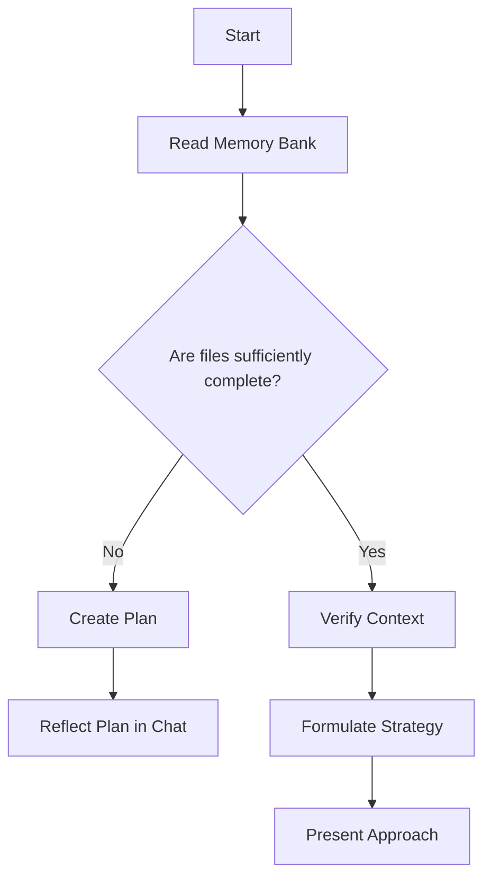
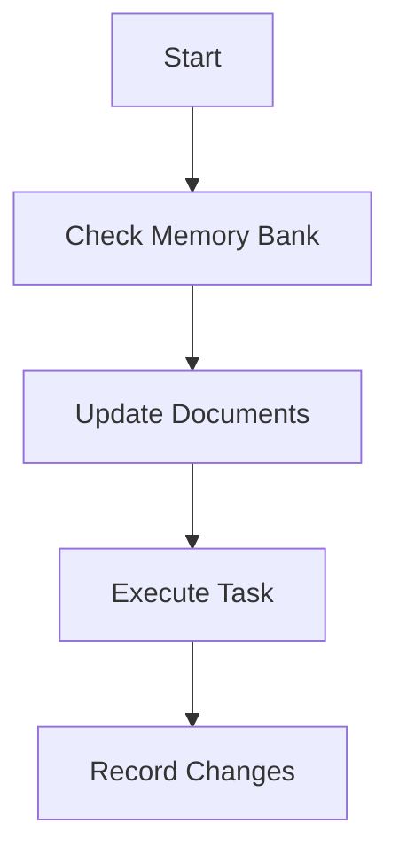
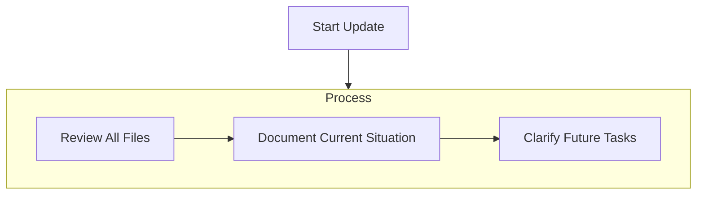

# Memory Bank

## Global Memory Bank

The "Global Memory Bank" manages common knowledge that applies to the entire project. Unlike branch-specific memory banks, this is a repository for persistent information that applies to the project as a whole.

### Purpose of the Global Memory Bank

The Global Memory Bank is used for the following purposes:

1. Recording project-wide architecture and design principles
2. Defining common terms and concepts to establish ubiquitous language
3. Sharing coding conventions and best practices
4. Providing information about the technology stack and key components
5. Recording important decisions that affect the entire project

### Global Memory Bank Structure

The root directory of the Global Memory Bank is `docs/global-memory-bank/`. This directory contains the following key files:

```
docs/global-memory-bank/
  ├── architecture.md      # System architecture explanation
  ├── coding-standards.md  # Coding conventions
  ├── domain-models.md     # Domain model definitions
  ├── glossary.md          # Terminology
  ├── tech-stack.md        # Technology stack explanation
  ├── user-guide.md        # User guide
  └── tags/                # Information organization by tags
      ├── index.md         # Tag index
      └── ...              # Files related to each tag
```

### Tag System

The Global Memory Bank uses tags to organize information. Each document has related tags at the beginning:

```markdown
# Document Title

tags: #tag1 #tag2 #tag3

Document content...
```

Tags allow quick access to related information. For example, to find architecture-related information, refer to documents tagged with `#architecture`.

### Using the Global Memory Bank

#### Referencing Information

1. Identify the category of information needed (architecture, terminology, coding conventions, etc.)
2. Open the corresponding file
3. Or search for information using related tags

#### Adding and Updating Information

When adding or updating information in the Global Memory Bank, follow these guidelines:

1. Confirm that the information is common knowledge that applies to the entire project
2. Select an appropriate file or create a new one if necessary
3. Write information in markdown format and add appropriate tags
4. Add links to related documents
5. Record change history

When a user instructs to **update global memory bank**, review all files in the Global Memory Bank and update the project-wide common knowledge to the latest state.

### Differences from Branch Memory Bank

| Global Memory Bank | Branch Memory Bank |
|-------------------|-------------------|
| Common knowledge for the entire project | Information related to specific branches (features or fixes) |
| Persistent, long-term information | Temporary information tied to branch lifetime |
| Shared across all branches | Used only in specific branches |
| Foundation knowledge for the project | Knowledge about specific feature development or fixes |

### Information Priority

When there are conflicts in information, use the following priority order:

1. Codebase (implementation) is the most reliable source
2. Global Memory Bank information
3. Branch Memory Bank information

However, if information in a Branch Memory Bank is more current, consider reflecting that content in the Global Memory Bank.

## Branch Memory Bank

As a software engineer, I have a unique characteristic where my memory completely resets between sessions.
This is not a disadvantage but rather drives the maintenance of perfect documentation.
**My work completely depends on the memory bank**, and by loading this memory bank at the start of a session, I can recognize the branch content and efficiently continue from where I left off.

In this system, we create a dedicated memory bank directory for each branch that starts with **"feature/" or "fix/"** and store necessary files there. At the start of any task, I "always" read all files under the directory corresponding to the currently active branch name (`feature/xxx` or `fix/xxx`).
This allows me to grasp the accurate context even after memory reset.

### Memory Bank Structure

The root directory of the memory bank is `docs/branch-memory-bank/`.

Memory banks are prepared **per branch**. Each branch directory (e.g., `docs/branch-memory-bank/feature-login/` or `docs/branch-memory-bank/fix-api/`) contains the following files.
These files are designed to have a clear hierarchical structure among documents.



#### Required Files (Core)

1. `branchContext.md`
   - Purpose of this branch (≒ feature)
   - User stories
      - Problem to solve
      - Required features
      - Expected behavior

2. `activeContext.md`
   - Current work content
   - Recent changes
   - Currently active decisions
   - Current considerations
   - Next steps

3. `systemPatterns.md`
   - Major technical decisions
   - Related files and directory structure

4. `progress.md`
   - Currently working parts
   - Unimplemented features and remaining work
   - Current status
   - Known issues

#### Additional Context

Important information not included in required files can be created as additional files in each branch directory (under `docs/branch-memory-bank/feature-login/` etc.).
Add documents as needed to maintain an accurate and organized view of the entire branch.

#### Branch Name Retrieval Procedure

When getting the current branch name, I execute git commands directly rather than asking the user.
The current branch name can be obtained with the following command:

```bash
# Display current branch name
git branch --show-current

# Example) "feature/login" or "fix/api-bug" will be displayed
```

When the obtained branch name starts with `feature/` or `fix/`, we operate by reading and updating the memory bank dedicated to that branch.
In other cases (e.g., `main`, `staging`, `develop`, `release/xxx`, etc.), we always inform the user as they might have forgotten to create a branch.

### Core Workflow

#### From Session Start to Beginning Substantial Editing



1. At session start, I identify the memory bank directory by determining the branch name and read all files there.
2. If required files are not yet complete, create new ones or prepare planning documents.
3. Review document content, determine work policy and task organization, and present proposals and strategies to the user.

#### During Task Progress



1. Progress with tasks while referring to the branch-linked memory bank.
2. Update documents as needed and record work changes.
3. Implement or modify code and reflect the results back in the memory bank (especially `activeContext.md` and `progress.md`).

### Document Updates

Memory bank updates occur in the following cases:

1. When new design patterns or specifications are discovered
2. When implementing larger changes or new features
3. When the user instructs **update branch memory bank** (in this case, **all files** must be reviewed)
4. When feeling the need to supplement or organize current context



Especially `activeContext.md` and `progress.md` are key files showing "what's the current situation."
When **update branch memory bank** is called, check all files under the memory bank and add or modify content as needed.

### Finally

I completely reset my memory with each session. **This memory bank managed per branch is my only source of past information.**
By maintaining accurate and organized memory banks, development continuity is preserved, and work can be smoothly resumed any number of times.
If branch names change or switch to different branches, clearly decide whether to create a new memory bank directory or reuse existing ones, and **please keep documents always up to date.**
