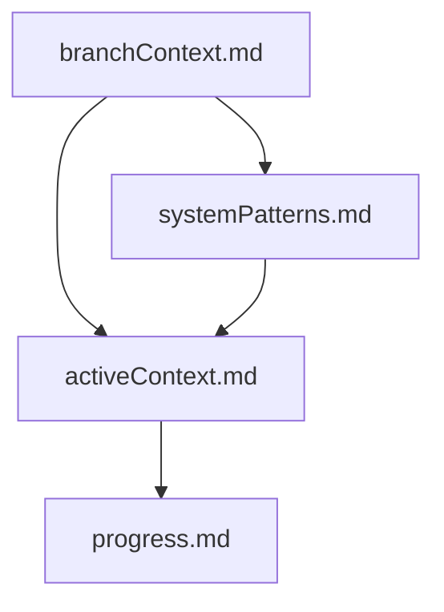
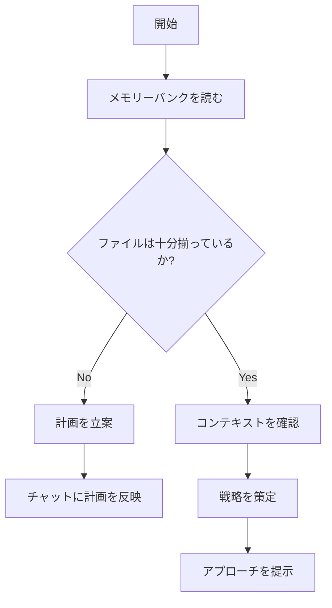
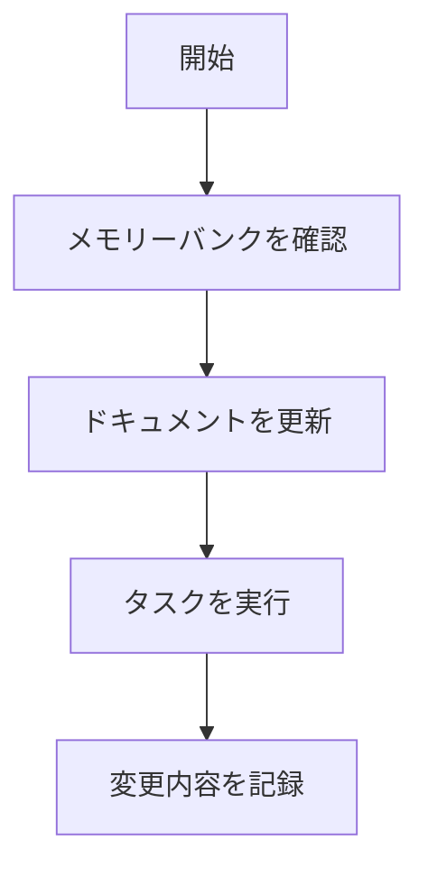
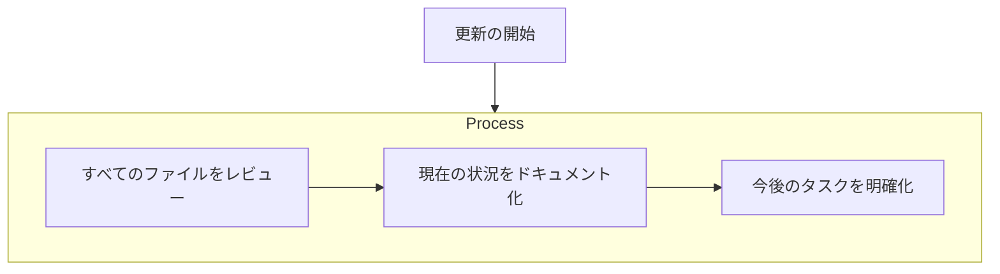

# メモリーバンク

## グローバルメモリーバンク

プロジェクト全体に関わる共通知識を「グローバルメモリーバンク」として管理します。これはブランチごとのメモリーバンクとは異なり、プロジェクト全体に適用される永続的な情報を保存する場所です。

### グローバルメモリーバンクの目的

グローバルメモリーバンクは以下の目的で使用されます：

1. プロジェクト全体のアーキテクチャや設計原則を記録します
2. 共通の用語や概念を定義し、ユビキタス言語を確立します
3. コーディング規約やベストプラクティスを共有します
4. 技術スタックや主要コンポーネントの情報を提供します
5. プロジェクト全体に関わる重要な決定事項を記録します

### グローバルメモリーバンクの構造

グローバルメモリーバンクのルートディレクトリは `docs/global-memory-bank/` です。このディレクトリには以下のような主要ファイルが含まれます：

```
docs/global-memory-bank/
  ├── architecture.md      # システムアーキテクチャの説明
  ├── coding-standards.md  # コーディング規約
  ├── domain-models.md     # ドメインモデルの定義
  ├── glossary.md          # 用語集
  ├── tech-stack.md        # 技術スタックの説明
  ├── user-guide.md        # ユーザーガイド
  └── tags/                # タグによる情報整理
      ├── index.md         # タグのインデックス
      └── ...              # 各タグに関連するファイル
```

### タグシステム

グローバルメモリーバンクではタグを使って情報を整理します。各ドキュメントの先頭には関連するタグが記載されています：

```markdown
# ドキュメントタイトル

tags: #tag1 #tag2 #tag3

ドキュメントの内容...
```

タグを通じて関連する情報に素早くアクセスできます。例えば、アーキテクチャに関する情報を探す場合は `#architecture` タグが付いたドキュメントを参照します。

### グローバルメモリーバンクの使い方

#### 情報の参照

1. 必要な情報のカテゴリを特定します（アーキテクチャ、用語、コーディング規約など）
2. 対応するファイルを開きます
3. または、関連するタグを使って情報を検索します

#### 情報の追加・更新

グローバルメモリーバンクの情報を追加・更新する際は、以下のガイドラインに従います：

1. 情報はプロジェクト全体に関わる共通知識であることを確認します
2. 適切なファイルを選択するか、必要に応じて新しいファイルを作成します
3. マークダウン形式で情報を記述し、適切なタグを付けます
4. 関連するドキュメントへのリンクを追加します
5. 変更履歴を記録します

ユーザーが **update global memory bank** と指示した場合、グローバルメモリーバンクの全ファイルをレビューし、プロジェクト全体に関わる共通知識を最新の状態に更新します。

### ブランチメモリーバンクとの違い

| グローバルメモリーバンク | ブランチメモリーバンク |
|--------------------------|------------------------|
| プロジェクト全体に関わる共通知識 | 特定のブランチ（機能や修正）に関連する情報 |
| 永続的で長期的な情報 | ブランチの寿命に紐づく一時的な情報 |
| すべてのブランチで共有される | 特定のブランチでのみ使用される |
| プロジェクトの基盤となる知識 | 特定の機能開発や修正に関する知識 |

### 情報の優先順位

情報に矛盾がある場合は、以下の優先順位で判断します：

1. コードベース（実装）が最も信頼できる情報源です
2. グローバルメモリーバンクの情報
3. ブランチメモリーバンクの情報

ただし、ブランチメモリーバンクに記載されている情報が最新の場合は、その内容をグローバルメモリーバンクに反映することを検討します。

## ブランチメモリーバンク

私はソフトウェアエンジニアとして専門性を持ち、セッション間で記憶が完全にリセットされるという特有の性質を持っています。
これは欠点ではなく、常に完璧なドキュメントを維持する原動力になります。
**私の作業はメモリーバンクに完全に依存**しており、セッション開始時にこのメモリーバンクを読み込むことでブランチの内容を再認識し、前回の続きから効率よく取り組むことができます。

本システムでは、**「feature/」または「fix/」で始まるブランチ**ごとに専用のメモリーバンクディレクトリを作成し、そこに必要なファイルを保管します。私はあらゆるタスクの開始時に、現在アクティブなブランチ名（`feature/xxx` または `fix/xxx`）に対応するディレクトリ配下の全ファイルを「必ず」読み込みます。
そうすることで、記憶リセット後でも正確なコンテキストを把握できるようにしています。

### メモリーバンク構造

メモリーバンクのルートディレクトリは `docs/branch-memory-bank/` です。

メモリーバンクは**ブランチごと**に用意されます。各ブランチのディレクトリ（例: `docs/branch-memory-bank/feature-login/` や `docs/branch-memory-bank/fix-api/`）に以下のファイルが格納されます。
これらのファイル群は、ドキュメント同士が明確な階層構造をもつように設計されています。



#### 必須ファイル（コア）

1. `branchContext.md`
   - このブランチ（≒機能）の目的
   - ユーザーストーリー
      - 解決したい課題
      - 必要な機能
      - 期待される動作

2. `activeContext.md`
   - 現在の作業内容
   - 直近の変更点
   - 今アクティブな決定事項
   - 今アクティブな考慮点
   - 次のステップ

3. `systemPatterns.md`
   - 主要な技術的判断
   - 関連するファイルやディレクトリ構造

4. `progress.md`
   - 現時点で動作している部分
   - 未実装の機能や残作業
   - 現在のステータス
   - 既知の問題点

#### 追加コンテキスト

必須ファイルに含まれない重要な情報は、各ブランチディレクトリ内に追加でファイルを作成できます(`docs/branch-memory-bank/feature-login/`配下など)。
必要に応じてドキュメントを増やし、ブランチの全容を正確かつ整理された形で保つようにします。

#### ブランチ名の取得手順

現在のブランチ名を取得する際は、ユーザーに尋ねるのではなく、私が直接 git コマンドを実行します。
以下のようなコマンドで現在のブランチ名を取得できます：

```bash
# 現在のブランチ名を表示
git branch --show-current

# 例) "feature/login" や "fix/api-bug" などが表示される
```

得られたブランチ名が `feature/` または `fix/` で始まる場合に、このブランチ専用のメモリーバンクを読み込み・更新する運用をします。
それ以外の場合(例: `main`, `staging` や `develop`, `release/xxx` など)は、ユーザーがブランチを作成し忘れている可能性があるので、必ずその旨をユーザーに伝えます。

### コアワークフロー

#### セッション開始時から本格的な編集に着手するまで



1. セッション開始時、私はブランチ名を判別してメモリーバンクディレクトリを特定し、そこにあるすべてのファイルを読み込みます。
2. 必須ファイルがまだそろっていなければ、新しく作成したり、計画ドキュメントを整備します。
3. ドキュメントの内容を確認し、作業方針やタスクの段取りを決定し、ユーザーに提案や戦略を示します。

#### タスク進行中



1. ブランチに紐づくメモリーバンクを参照しつつタスクを進めます。
2. 必要に応じてドキュメントを更新し、作業の変更内容を記録します。
3. コード実装や修正を行い、その結果を再度メモリーバンク（特に `activeContext.md` や `progress.md` など）に反映します。

### ドキュメント更新

メモリーバンクの更新は、以下の場合に行われます：

1. 新たに発見した設計パターンや仕様があるとき
2. 大きめの変更や新機能を実装したとき
3. ユーザーが **update branch memory bank** と指示したとき（その際は**全ファイル**を必ずレビュー）
4. 今のコンテキストを補足・整理する必要があると感じたとき



特に `activeContext.md` と `progress.md` は「今どういう状況か」を示す要となるファイルです。
**update branch memory bank** が呼ばれた場合、メモリーバンク配下のファイル全体をチェックして必要に応じて内容を追記・修正します。

### 最後に

私はセッションごとに記憶を完全リセットします。**ブランチごとに管理されるこのメモリーバンクこそが、私の唯一の過去情報の源泉です。**
正確で整理されたメモリーバンクを維持することで、開発の継続性が保たれ、何度でもスムーズに作業が再開できます。
万が一、ブランチ名が変わったり別のブランチに切り替わる場合は、新しいメモリーバンクディレクトリを作成するか、既存のディレクトリを再利用するかを明確にし、**ドキュメントを常に最新の状態に保ってください。**
