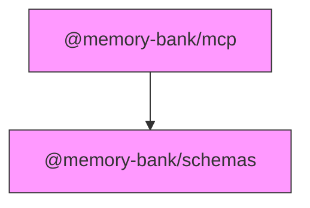

# Schema Package Structure

Generated on: 2025-03-28T03:56:42.787Z

## Schema Package Structure (dependency)

```mermaid
graph TB
  %% Schema Package Structure (dependency)

  _memory_bank_mcp["@memory-bank/mcp"]
  _memory_bank_schemas["@memory-bank/schemas"]

  _memory_bank_mcp --> _memory_bank_schemas

  %% スタイル定義
  classDef package fill:#f9f,stroke:#333,stroke-width:1px;

  %% クラス定義の適用
  class _memory_bank_mcp package;
  class _memory_bank_schemas package;
```
